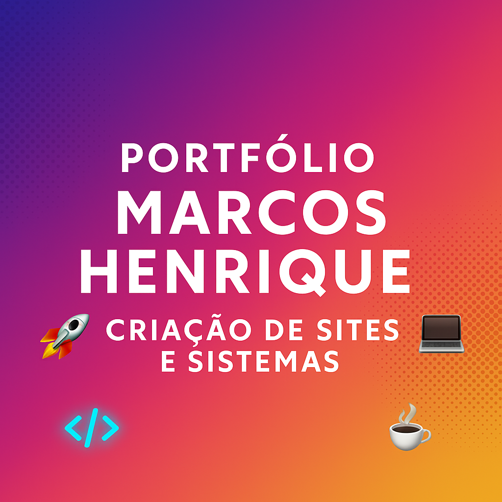

<p align="center">
  
</p>

<h1 align="center">🚀 Portfólio - Marcos Henrique 🚀</h1>

<p align="center">
  <b>Desenvolvedor FullStack | Front-End & Back-End | UI/UX | Criador de Soluções Digitais</b><br>
  <a href="https://portfoliomarcowdev.netlify.app" target="_blank">🌐 Acesse meu Portfólio Online</a>
</p>

---

## 🧠 Sobre mim

Sou apaixonado por tecnologia, desenvolvimento web e transformar ideias em projetos reais.  
Trabalho criando **sites, landing pages, APIs, dashboards, sistemas e soluções digitais personalizadas.**  

Foco em entregar **projetos rápidos, responsivos, modernos e profissionais.**  

---

## 🚀 Tecnologias e Ferramentas

- 🖥️ HTML5, CSS3, JavaScript
- 🎨 UI/UX Design, Animações, Responsividade
- ⚙️ Backend com Python e Django
- 🗄️ Banco de Dados SQL e NoSQL
- 🐙 Git, GitHub, Versionamento
- 🌐 Deploy: Netlify, Vercel e Render

---

## 💻 Link do Portfólio

➡️ **[Acesse meu Portfólio Online](https://portfoliomarcowdev.netlify.app)**  

---

## 📜 Status do Projeto

✅ Portfólio **online, atualizado e em constante evolução!**  
✅ Novos projetos e melhorias sendo adicionadas com frequência.  

---

## 🏗️ Projetos em destaque

| Projeto                    | Status                | Link               |
|----------------------------|-----------------------|--------------------|
| Queen Of Braids            | ✅ Concluído          | [Ver projeto](https://queen-of-braids.netlify.app) |
| Landing Page Tech          | 🔧 Em desenvolvimento | - |
| Dashboard Financeiro       | 🔧 Em desenvolvimento | - |
| Site de Receitas           | 🔧 Em desenvolvimento | - |


## 📁 Estrutura do Projeto

<p>/css → Arquivos de estilização (CSS)</p>
<p>/imagens → Imagens do site</p>
<p>/projetos → Páginas individuais dos projetos</p>
<p>index.html → Página inicial</p>
<p>sobre.html → Página sobre mim</p>
<p>projetos.html → Página dos projetos</p>
<p>contato.html → Página de contato</p>

<p>🤝 Contato</p>

📧 marcos@aurorainteligencia.com.br

📧 hanry.marcos018@gmail.com

💼 *[LinkedIn](ttps://www.linkedin.com/in/marcos-henrique-338554238)*

🌐 *[Portfólio Online](https://portfoliomarcowdev.netlify.app)*


<p align="center"> 🖤 Feito com muito café ☕, código 💻 e amor 🖤 </p> ```


---

## 🛠️ Como executar localmente

1. Clone o repositório:
```bash
git clone https://github.com/marcowdev/Portfolio.git

Acesse a pasta do projeto:

cd Portfolio

Abra o arquivo index.html no navegador.

